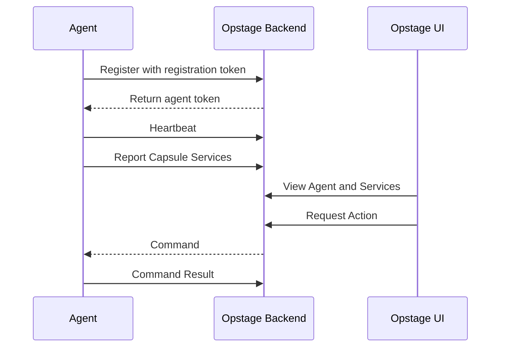

# xtrape-capsule-site 开发指引

> 目标：实现一个面向 public 的 `xtrape-capsule` 官网与文档站，用于对外介绍 Xtrape Capsule、Opstage CE、Agent SDK、Capsule Service 概念、快速入门和版本路线。

本指引用于交给 AI / Codex / Claude Code / Cursor 等代码代理执行。

---

## 1. 项目背景

`xtrape-capsule` 是面向 AI 时代轻服务的运行态治理体系。

它围绕以下核心概念展开：

- **Capsule Service**：轻量、自治、可注册、可观测、可配置、可审计的小型服务单元。
- **Opstage**：管理 Capsule Services 的轻量级运行态治理控制面。
- **Agent**：嵌入或部署在服务侧，用于主动注册、心跳、上报健康/配置/动作，并执行 Opstage 下发命令。
- **Agent Registration Model**：Agent 主动注册到 Opstage，获得授权后接入治理。
- **Capsule Management Contract**：Capsule Service 与 Opstage/Agent 之间的管理契约。

当前已有仓库：

```text
https://github.com/xtrape-com/xtrape-capsule-ce
https://github.com/xtrape-com/xtrape-capsule-docs
https://github.com/xtrape-com/xtrape-capsule-contracts-node
https://github.com/xtrape-com/xtrape-capsule-agent-node
https://github.com/xtrape-com/xtrape-capsule-site
```

其中：

- `xtrape-capsule-ce` 是 Opstage CE 开源社区版主仓库。
- `xtrape-capsule-docs` 是设计文档、架构草案、规范沉淀仓库，不直接作为 public 入口。
- `xtrape-capsule-site` 是新的 public 官网与用户文档站。

---

## 2. 本仓库定位

`xtrape-capsule-site` 不应是内部设计文档仓库，而应是：

```text
Public Website + Product Documentation + Developer Guide + Release Entry
```

它的主要目标：

1. 让用户 30 秒内理解 Xtrape Capsule 是什么；
2. 让用户 5 分钟内运行 Opstage CE；
3. 让开发者 10 分钟内接入第一个 Capsule Service；
4. 为 CE / EE / Cloud 三版本产品线建立公开说明；
5. 为后续开源推广、发布文章、GitHub README、npm 包和 Docker 镜像提供统一文档入口。

---

## 3. 技术选型

建议使用：

```text
VitePress + TypeScript + Markdown
```

原因：

- 轻量；
- 适合技术文档；
- 易部署到 GitHub Pages / Cloudflare Pages / Vercel；
- 支持首页、侧边栏、导航、搜索、代码高亮；
- 与 Xtrape 文档体系保持一致。

如果仓库尚未初始化，使用 VitePress 初始化。

---

## 4. 推荐项目结构

请按如下结构实现：

```text
xtrape-capsule-site/
├── docs/
│   ├── index.md
│   ├── getting-started/
│   │   ├── quick-start.md
│   │   ├── install-opstage-ce.md
│   │   └── first-capsule-service.md
│   ├── concepts/
│   │   ├── capsule-service.md
│   │   ├── opstage.md
│   │   ├── agent.md
│   │   ├── agent-registration.md
│   │   └── management-contract.md
│   ├── opstage-ce/
│   │   ├── overview.md
│   │   ├── docker-deployment.md
│   │   ├── configuration.md
│   │   ├── admin-ui.md
│   │   └── backup-and-upgrade.md
│   ├── agents/
│   │   ├── node-embedded-agent.md
│   │   ├── action-model.md
│   │   ├── health-reporting.md
│   │   └── config-reporting.md
│   ├── contracts/
│   │   ├── overview.md
│   │   ├── manifest.md
│   │   ├── health.md
│   │   ├── actions.md
│   │   └── errors.md
│   ├── use-cases/
│   │   ├── integration-services.md
│   │   ├── playwright-workers.md
│   │   ├── account-pool.md
│   │   └── ai-agent-runtime.md
│   ├── editions/
│   │   ├── ce.md
│   │   ├── ee.md
│   │   └── cloud.md
│   ├── security/
│   │   ├── overview.md
│   │   ├── token-model.md
│   │   └── agent-security.md
│   ├── roadmap.md
│   ├── faq.md
│   └── glossary.md
├── blog/
│   └── introducing-xtrape-capsule.md
├── public/
│   ├── screenshots/
│   └── diagrams/
├── package.json
├── README.md
└── .gitignore
```

如果第一阶段时间有限，至少实现以下 10 篇文档：

```text
docs/index.md
docs/getting-started/quick-start.md
docs/getting-started/first-capsule-service.md
docs/concepts/capsule-service.md
docs/concepts/opstage.md
docs/concepts/agent-registration.md
docs/agents/node-embedded-agent.md
docs/opstage-ce/docker-deployment.md
docs/security/token-model.md
docs/roadmap.md
```

---

## 5. 首页设计要求

首页必须面向外部用户，而不是内部架构师。

### 5.1 Hero 文案

英文主标题：

```text
Xtrape Capsule
```

英文副标题：

```text
A lightweight control plane for AI-era Capsule Services.
```

中文说明：

```text
面向 AI 时代轻服务的轻量级运行态治理平台。
```

扩展说明：

```text
Connect small services, automation workers, integration services, and agent runtimes to a unified Opstage console through an embedded Agent SDK.
```

中文：

```text
通过 Agent SDK，让小型服务、自动化 Worker、集成服务与 Agent Runtime 接入统一的 Opstage 控制台。
```

### 5.2 首页按钮

至少包含：

```text
Get Started
View on GitHub
Install Opstage CE
Build Your First Capsule Service
```

按钮链接到：

```text
/getting-started/quick-start
/getting-started/first-capsule-service
https://github.com/xtrape-com/xtrape-capsule-ce
https://github.com/xtrape-com/xtrape-capsule-agent-node
```

### 5.3 首页核心模块

首页至少包含以下模块：

1. What is Xtrape Capsule?
2. Why Capsule Services?
3. What is Opstage?
4. How it works
5. Quick Start
6. Developer SDK
7. Editions: CE / EE / Cloud
8. Use Cases
9. Roadmap
10. GitHub Links

---

## 6. 导航设计

VitePress 顶部导航建议：

```text
Guide
Concepts
Opstage CE
Agents
Contracts
Use Cases
Editions
Roadmap
GitHub
```

侧边栏建议：

```text
Guide
  Quick Start
  Install Opstage CE
  First Capsule Service

Concepts
  Capsule Service
  Opstage
  Agent
  Agent Registration
  Management Contract

Opstage CE
  Overview
  Docker Deployment
  Configuration
  Admin UI
  Backup and Upgrade

Agents
  Node Embedded Agent
  Action Model
  Health Reporting
  Config Reporting

Contracts
  Overview
  Manifest
  Health
  Actions
  Errors

Use Cases
  Integration Services
  Playwright Workers
  Account Pool
  AI Agent Runtime

Editions
  Community Edition
  Enterprise Edition
  Cloud

Security
  Overview
  Token Model
  Agent Security

Roadmap
FAQ
Glossary
```

---

## 7. 文档内容要求

### 7.1 `quick-start.md`

目标：用户 5 分钟运行 Opstage CE。

必须包含：

- 前置条件；
- Docker 启动方式；
- Docker Compose 启动方式；
- 默认访问地址；
- 默认管理员账号说明；
- 数据持久化说明；
- 如何停止；
- 如何清理数据；
- 常见问题。

示例命令可以使用占位形式，后续按真实镜像调整：

```bash
docker run -p 8080:8080 -v opstage-data:/app/data ghcr.io/xtrape-com/xtrape-capsule-ce:latest
```

如果镜像尚未发布，需明确标注：

```text
Docker image is planned. Use local Docker Compose build for now.
```

---

### 7.2 `first-capsule-service.md`

目标：开发者 10 分钟接入一个最小 Node.js Capsule Service。

必须包含：

- 安装 Agent SDK；
- 配置 Opstage URL；
- 配置 registration token；
- 声明 service manifest；
- 上报 health；
- 声明 config；
- 声明 action；
- 启动 agent；
- 在 UI 中验证服务在线；
- 执行 action；
- 查看 audit event。

示例代码需使用 TypeScript。

如果 SDK API 尚未稳定，可以加注释：

```text
The following example may need to be adjusted according to the current SDK API.
```

---

### 7.3 `capsule-service.md`

必须解释：

- Capsule Service 是什么；
- 与 Microservice 的区别；
- 为什么 AI 时代会有大量 Capsule Services；
- 典型例子：集成服务、Playwright Worker、账号池、会话池、AI Agent Runtime、OTP Reader、Proxy Checker；
- Capsule Service 的基本要求：可注册、可观测、可配置、可操作、可审计。

建议包含对比表：

| Dimension | Microservice | Capsule Service |
|---|---|---|
| Primary goal | Business domain decomposition | Lightweight capability governance |
| Runtime | Usually long-running service | Service / worker / connector / agent runtime |
| Management | Service mesh / platform engineering | Agent-based runtime governance |
| Typical stack | Java/Spring, Go, Node | Node, Python, Java, scripts, workers |

---

### 7.4 `opstage.md`

必须解释：

- Opstage 是什么；
- 为什么不是传统配置中心；
- 为什么不是普通监控系统；
- 为什么不是普通后台管理系统；
- UI / Backend / Agent 三层结构；
- CE / EE / Cloud 的关系。

核心表达：

```text
Opstage is an agent-based runtime governance control plane for Capsule Services.
```

中文：

```text
Opstage 是面向 Capsule Service 的 Agent-based 运行态治理控制面。
```

---

### 7.5 `agent-registration.md`

必须解释注册流程：

1. 管理员创建 registration token；
2. Agent 使用 registration token 注册；
3. Backend 校验 token；
4. Backend 返回 agent token；
5. Agent 使用 agent token 进行心跳、上报、命令拉取；
6. Opstage 根据心跳判断 Agent 在线/离线；
7. Opstage 根据 service report 判断 Capsule Service 在线/异常/过期。

建议包含 Mermaid 流程图：



---

### 7.6 `node-embedded-agent.md`

必须说明：

- Node Embedded Agent 是什么；
- 适用场景；
- 安装；
- 最小接入示例；
- health reporting；
- config reporting；
- action model；
- command polling；
- 安全注意事项；
- 与 `@xtrape/capsule-agent-node` 仓库的关系。

---

### 7.7 `docker-deployment.md`

必须说明：

- 单镜像部署；
- Docker Compose 部署；
- SQLite 数据目录；
- 环境变量；
- 端口；
- 日志；
- 备份；
- 升级注意事项。

---

### 7.8 `token-model.md`

必须说明：

- registration token；
- agent token；
- token 生命周期；
- token 存储建议；
- token 泄露处理；
- 为什么数据库只保存 hash；
- 为什么 Agent 采用主动出站连接；
- SaaS/Cloud 未来如何避免保存客户侧敏感凭证。

---

### 7.9 `roadmap.md`

必须包含：

```text
v0.1 Public Preview
v0.2 Basic Ops
v0.3 Capsule Spec
v0.4 Agent Expansion
v1.0 CE Stable
Future EE
Future Cloud
```

注意：不要承诺具体日期。使用：

```text
Current
Planned
Future
Experimental
```

---

## 8. CE / EE / Cloud 页面要求

`editions/ce.md`：

- 说明 CE 是开源社区版；
- 默认 SQLite；
- 单机部署；
- Node Embedded Agent；
- Agent 注册；
- 健康、配置、动作、审计；
- 适合个人、小团队、私有化轻服务。

`editions/ee.md`：

- 说明 EE 是未来私有化商业版；
- 适合企业客户；
- 包括 RBAC、SSO、HA、集群部署、集中日志、监控大屏、Secret Vault、企业审计等；
- 明确标注 planned/future，不要夸大当前能力。

`editions/cloud.md`：

- 说明 Cloud 是未来 SaaS 云服务版；
- Agent 主动连接 Cloud；
- Cloud 默认保存元数据、状态、审计，不保存客户侧敏感凭证；
- 适合不想自建 Opstage 的团队；
- 明确标注 planned/future。

---

## 9. Use Cases 页面要求

第一批 use cases：

1. Integration Services
2. Playwright Workers
3. Account Pool
4. AI Agent Runtime

每篇文档使用统一结构：

```markdown
# Use Case: xxx

## Problem

## How Capsule helps

## Typical Architecture

## What Opstage can show

## What Opstage can do

## Next steps
```

重点强调真实痛点，而不是抽象概念。

---

## 10. FAQ 要求

`faq.md` 至少回答：

1. Xtrape Capsule 是什么？
2. Capsule Service 和 Microservice 有什么区别？
3. Opstage 和 Nacos/Apollo 有什么区别？
4. Opstage 和 Prometheus/Grafana 有什么区别？
5. Opstage 和 Backstage 有什么区别？
6. Opstage 是否会保存我的账号密码、Cookie 或 Token？
7. Agent 为什么要主动注册？
8. CE 是否可以商用？
9. EE 和 Cloud 什么时候提供？
10. 当前版本是否 production ready？

---

## 11. 视觉与风格要求

整体风格：

```text
clean
technical
developer-friendly
not over-marketing
not enterprise-heavy
```

表达上避免：

```text
革命性
颠覆性
全能平台
替代所有运维工具
生产级企业平台
```

优先使用：

```text
lightweight
self-hosted
agent-based
runtime governance
Capsule Services
AI-era services
operational control plane
```

中文表达优先使用：

```text
轻量
私有化部署
Agent 注册制
运行态治理
轻服务
控制面
可观测
可操作
可审计
```

---

## 12. 站点配置要求

VitePress 配置应包含：

- title: `Xtrape Capsule`
- description: `A lightweight control plane for AI-era Capsule Services.`
- theme config nav；
- sidebar；
- social links；
- search；
- edit link 可选；
- last updated 可选。

GitHub 链接：

```text
https://github.com/xtrape-com/xtrape-capsule-ce
https://github.com/xtrape-com/xtrape-capsule-agent-node
https://github.com/xtrape-com/xtrape-capsule-contracts-node
https://github.com/xtrape-com/xtrape-capsule-site
```

---

## 13. README 要求

仓库根目录 `README.md` 应说明：

```text
1. 这是 xtrape-capsule 的 public website/docs site；
2. 如何本地启动；
3. 如何构建；
4. 如何部署；
5. 文档贡献方式；
6. 相关仓库链接。
```

示例命令：

```bash
pnpm install
pnpm docs:dev
pnpm docs:build
pnpm docs:preview
```

---

## 14. 部署要求

优先支持 GitHub Pages。

需要添加 GitHub Actions workflow：

```text
.github/workflows/deploy.yml
```

触发条件：

```text
push to main
```

构建：

```bash
pnpm install --frozen-lockfile
pnpm docs:build
```

部署产物：

```text
docs/.vitepress/dist
```

如果暂时不配置自动部署，也需在 README 中写出手动部署方式。

---

## 15. 执行顺序

请按以下顺序执行：

```text
1. 初始化 VitePress 项目；
2. 配置 package.json scripts；
3. 配置 docs/.vitepress/config.ts；
4. 创建首页 docs/index.md；
5. 创建第一批 10 篇核心文档；
6. 创建导航与侧边栏；
7. 创建 README.md；
8. 添加 public/screenshots 和 public/diagrams 目录；
9. 添加 GitHub Actions 部署 workflow；
10. 本地执行 build，修复链接和 Markdown 错误。
```

---

## 16. 第一阶段验收标准

完成后应满足：

```text
[ ] `pnpm install` 成功
[ ] `pnpm docs:dev` 可启动本地站点
[ ] `pnpm docs:build` 成功
[ ] 首页 30 秒内能让用户理解项目
[ ] Quick Start 可以指导用户启动 Opstage CE
[ ] First Capsule Service 页面有 Node SDK 示例
[ ] Concepts 页面解释 Capsule Service / Opstage / Agent
[ ] Roadmap 明确区分 CE / EE / Cloud
[ ] FAQ 回答与 Nacos/Apollo/Prometheus/Backstage 的区别
[ ] README 包含本地开发和部署说明
[ ] 站点导航清晰，无死链
```

---

## 17. 内容边界

本 public site 不应包含：

```text
1. 专利和法律护城河讨论；
2. 内部商业策略细节；
3. 未公开的 EE/Cloud 实现细节；
4. 未确认的报价和商业条款；
5. 安全敏感实现细节；
6. 过深的数据库表设计；
7. 内部命名争论和历史讨论。
```

这些内容应保留在内部设计文档或私有仓库中。

---

## 18. 最终目标

完成后，`xtrape-capsule-site` 应成为所有对外材料的统一入口。

其他仓库 README 应最终指向该站点：

```text
xtrape-capsule-ce              -> xtrape-capsule-site
xtrape-capsule-agent-node      -> xtrape-capsule-site/agents/node-embedded-agent
xtrape-capsule-contracts-node  -> xtrape-capsule-site/contracts/overview
```

一句话目标：

```text
Make Xtrape Capsule understandable, runnable, and adoptable for public developers.
```

中文：

```text
让外部开发者看得懂、跑得起、接得上 Xtrape Capsule。
```
